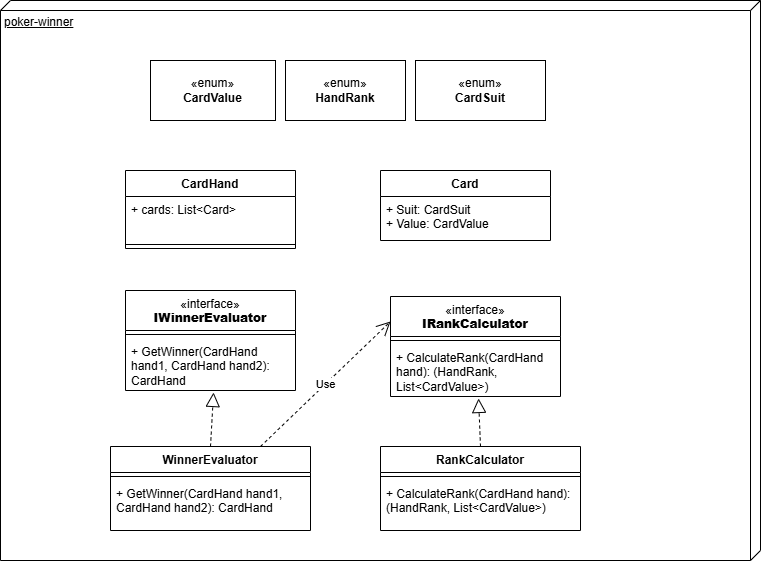

# Poker Winner Evaluator

A small app that determines the winner of two poker hands.

## Design

The application is built using .NET 10 and follows a clean architecture approach. It consists of a core library/CLI that handles the poker logic and a sample UI project using Spectre.Console for a more visual representation.



### Key Components
- **Domain**: Contains the core entities (`Card`, `CardHand`, `HandRank`) and enums.
- **Application**: Contains the business logic for calculating ranks and evaluating winners.
- **Contracts**: Interfaces for the services.

## Prerequisites

To run this program, you need:
- [.NET 10.0 SDK](https://dotnet.microsoft.com/download/dotnet/10.0)
- An IDE (JetBrains Rider recommended) or a terminal.


---

## 1. How to run the Program (Standard CLI)

This version executes several pre-defined poker scenarios and prints the results to the console.

### Using JetBrains Rider
1. Open the solution `PokerWinnerEvaluator.sln`.
2. Select the `PokerWinnerEvaluator.CLI` project in the "Run/Debug Configurations" dropdown.
3. Click the **Run** button (green play icon).

### Using Console (Terminal)
Navigate to the project root and run:
```powershell
dotnet run --project src\PokerWinnerEvaluator.CLI
```

---

## 2. How to run the Tests

The project uses NUnit for unit testing, covering rank calculations and winner evaluation.

### Using JetBrains Rider
1. Open the **Unit Tests** window (`Ctrl + Alt + U`).
2. Click **Run All Tests** (double green play icon).

### Using Console (Terminal)
Navigate to the project root and run:
```powershell
dotnet test
```

---

## 3. How to run the Spectre UI

This version provides a visual representation of poker hands using `Spectre.Console`.

### Using JetBrains Rider
1. Open the solution `PokerWinnerEvaluator.sln`.
2. Select the `PokerWinnerEvaluator.Spectre.UI` project in the "Run/Debug Configurations" dropdown.
3. Click the **Run** button (green play icon).

### Using Console (Terminal)
Navigate to the project root and run:
```powershell
dotnet run --project samples\PokerWinnerEvaluator.Spectre.UI
```